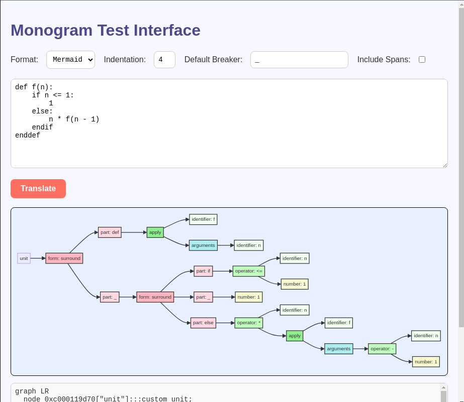

# Change Log for Monogram

Following the style in https://keepachangelog.com/en/1.0.0/


## Unreleased

### Changed

- Extended prefix-forms for C-style syntax
  - To accommodate this we had to remove `f{x, y}`, which is a breaking change.
  - N.B. The major version is not bumped as we have not reached our first release.

This allows us to accommodate loop syntax such as `while! (x) { ... }`, in the
style of C, and `while! x { ... }` in the style of Swift/Go. You can even
imitate cascaded conditionals:

```
# ! marks a prefix form.
if! predicate(x) {
  action(x)
} else-if test(y) {     # else-if is recognised as a 'breaker'
  action(y)
} else: {               # else: is also recognised as a 'breaker'
  0
}
```

Note that prefix-forms keep reading expressions until they find one that 
finishes on a line-break. So you need to follow the Python-like convention
of putting new-lines inside brackets.

- The Go module is renamed from `lib` to `mg` to provide a short and distinctive
  import name.

- Simple labels (e.g. `else:`) are now blocked from also being used as an
  ordinary identifier, improving the robustness of the parse in a variety of
  situations.


### Added

- Exponential notation for numbers now added e.g. 1.23e+8

- Support for non-decimal literal integers, using upper case-letters A-Z as
  digits for bases higher than 10.
  - The usual hex literals are supported e.g. 0xFF = 255
  - Binary literals e.g. 0b1100 = 12
  - Octal numbers e.g. 0o022 = 18
  - Arbitrary bases between 2-36 using `r`
    - e.g. 36rZZ = 1295
    - This syntax borrowed from Common Lisp, Prolog, Smalltalk and Pop-11, which
      is as close to a consensus as I could find.

- Support for non-decimal floating point, using upper case-letters A-Z
  - The prefixes `0x`, `0b`, `0o` and `0r` apply here
  - e.g. 0x1.8 = 1.5
  
- The `monogram` and `monogram-mini` tools have a new option `--decimal`.
  - This causes number nodes to have a new attribute `decimal` that holds
    the numerical value converted to a decimal string.

### Fixed

- Fixed abrupt exit from local web server when parse errors were encountered.

## [0.4.3] Fixed CodeQL Warnings

### Fixed

- [Internal] CodeQL warnings were being generated for GitHub workflows without explicit
  permissions. These have been added.

## [0.4.2] Fixed Docker image

### Fixed

- The Docker image now works correctly with --test. Now the test server 
  permits incoming connections from the host machine. This means that you can
  run the test server in a Docker container and access it from your host machine.

## [0.4.0] Asciitree Format

### Added

- A new output format `asciitree` has been added, suitable for inclusion
  in plain text documents. For example `{ y = x + 1; z = y * y; }` turns into:

```txt
unit
└─ delimited
   │  • kind: braces
   │  • separator: semicolon
   ├─ operator
   │  │  • name: =
   │  │  • syntax: infix
   │  ├─ identifier
   │  │     • name: y
   │  └─ operator
   │     │  • name: +
   │     │  • syntax: infix
   │     ├─ identifier
   │     │     • name: x
   │     └─ number
   │           • value: 1
   └─ operator
      │  • name: =
      │  • syntax: infix
      ├─ identifier
      │     • name: z
      └─ operator
         │  • name: *
         │  • syntax: infix
         ├─ identifier
         │     • name: y
         └─ identifier
               • name: y
```

- A new `install.sh` script that can be used as a quick and dirty way to 
  get monogram installed. Good for CI/CD pipelines.


## [0.3.0] Local Test Server

### Added 

- The new `--test` option runs `monogram` in an exploratory mode, 
  opens a web browser window with a test page.
- New executable `monogram-mini` that is built without the web server 
  for a reduced executable size (12MB -> 3MB).



## [0.2.8.5] More Bug Fixes

### Internal 

- Improved process for bumping version numbers

## [0.2.8] More Bug Fixes

### Fixes

- Fixed incorrect formating and span locations in error messages (#110)
- Fixed loophole around endendXXX identifiers (#111)
- Cleaned up messages in unit-tests.
- `foo!` now marks `foo` as a form-opener. See [decision record](docs/decisions/0014-prefix-forms-introduce-reserved-words/0014-prefix-forms-introduce-reserved-words.md).

## [0.2.7] Bug Fixes

### Fixes

- Inconsistent phrasing in the [README.md](README.md) has been fixed.

- A leading backslash is supposed to introduce an identifer. However this 
  was actually not being recognised as valid syntax. This is now fixed.

```
❯ echo '\_x' | monogram -f xml 
<unit>
  <identifier name="x" />
</unit>
```

- Statements were simple sequences of expressions. This was not intentional
  and the documented grammar is now enforced. This means that the statements 
  of a form are now separated by semi-colons or line breaks.

```
❯ echo 'block a = b * b; x = y + z endblock' | monogram -f xml 
<unit>
  <form syntax="surround">
    <part keyword="block">
      <operator name="=" syntax="infix">
        <identifier name="a" />
        <operator name="*" syntax="infix">
          <identifier name="b" />
          <identifier name="b" />
        </operator>
      </operator>
      <operator name="=" syntax="infix">
        <identifier name="x" />
        <operator name="+" syntax="infix">
          <identifier name="y" />
          <identifier name="z" />
        </operator>
      </operator>
    </part>
  </form>
</unit>

```

Or equivalently

```
❯ cat << "EOF" | ./monogram -f xml
block
    a = b * b
    x = y + z
endblock
EOF
<unit>
  <form syntax="surround">
    ETC ... deleted for brevity. Identical to above.
  </form>
</unit>

```

## [0.2.6] Docker image and Underscores in Numbers

### Added

- Underscores in numbers now supported

- Prebuilt binaries on release for popular platforms:
    - Linux on x86_64 and Arm64
    - MacOS on x86_64 and Arm64
    - Windows on Intel
- Docker image sfkleach/monogram pushed on release to Docker Hub
    - Use with `docker run --rm -i sfkleach/monogram [OPTIONS] < STDIN > STDOUT`

## [0.2.4] Fixes span info

### Added 

- CHANGELOG.md

### Fixed

- Span info for "unit" nodes
- Span info for chained infix operators


## [0.2.2.0] Fixes cosing triple quotes

### Fixes

- Closing triple quotes do not have to be on their own but may be followed by other text. e,g, for infix operators.
- Test recipes working.


## [0.2.1.1] Adds string interpolation and multi-line

### Added

- New `just` recipes `unittest` and `functest` for running the types types of tests.
- String interpolation
- Multi-line strings


## [0.2.0.5] Example implementations: calc and typecalc

### Added

- New --version option, integrated with GH workflow
- Example application calc: using dynamic 'monotype' AST
- Example application typecalc: using typed AST
- More functional tests
- Working GH Codespace
- More examples added to docs
- Status 'badges' added to the README.md

### Fixes

- Subtraction handled correctly in expressions such as `3-2`


## [0.2.0] First version of reference implementation in Golang

## [0.1] Proof of concept implemented in Pop-11


