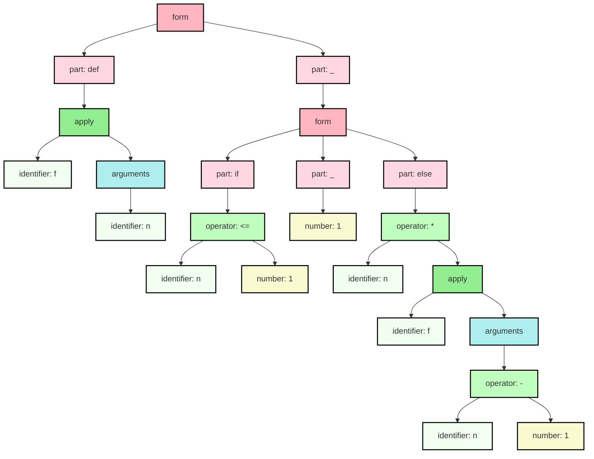

# Monogram

Monogram is a "no batteries" notation for writing domain-specific programs and
configuration files. It is easy for humans to read and write. It is easy for
machines to parse and generate. It deliberately borrows from many programming
languages but feels familiar to Python and Ruby programmers.

## _"It's source code, Jim. But not as we know it!"_

Here's an initial example to help explain what we mean by 'batteries not included'.
To experienced programmers, the following code looks a lot like the definition
of the factorial function:
```py
def f(n):
    if n <= 1:
        1
    else:
        n * f(n - 1)
    endif
enddef
```

However, the twist is that Monogram has no idea what `def` or `if` might mean!
Nor does it have a clue about `*` or `-` either. And it definitely cannot
execute this program. 

And yet Monogram can easily translate this example into neatly structured XML
(shown below). Or it can translate to [JSON](docs/json.md) or [YAML](docs/yaml.md).
```xml
<form>
    <part keyword="def">
        <apply kind="parentheses" separator="undefined">
            <identifier name="f"/>
            <arguments>
                <identifier name="n"/>
            </arguments>
        </apply>
    </part>
    <part keyword="_">
        <form>
            <part keyword="if">
                <operator name="&lt;=">
                    <identifier name="n"/>
                    <number value="1"/>
                </operator>
            </part>
            <part keyword="_">
                <number value="1"/>
            </part>
            <part keyword="else">
                <operator name="*">
                    <identifier name="n"/>
                    <apply kind="parentheses" separator="undefined">
                        <identifier name="f"/>
                        <arguments>
                            <operator name="-">
                                <identifier name="n"/>
                                <number value="1"/>
                            </operator>
                        </arguments>
                    </apply>
                </operator>
            </part>
        </form>
    </part>
</form>
```

Alternatively it can render the code as a diagram using Mermaid (below) or 
[Graphviz](docs/dot.md). Here's the same structure visualised as a graph.



In other words, Monogram is just a notation for writing program-like "code" but
comes without any built-in meanings. Although it is not infinitely flexible, it 
can often save you the effort of designing the syntax and implementing a parser
when you want an application/domain-specific language.

For more examples and more output formats (like JSON, YAML, PNG) see the 
[examples page](docs/examples.md).


## Monogram grammar

### Overview of tokens

The basic building blocks of a Monogram document are tokens - that is to say
numbers (`123`, `-0.12`), strings (`"hello, world"`), symbols (`{`, `}`), signs
(`:`, `++`) and various kinds of identifiers (`true`, `x`, `while`). These will
be largely familiar to anyone used to working with JSON or any mainstream
programming language.

Full details of tokenisation are given on [this page](docs/tokens.md) but
because these are generally so familiar to most programmers we highlight just a
few aspects that will be less familiar here:

- **Strings** support all three quote characters: single , double and back quotes.
    - All three are completely symmetrical in their design.
    - And support escape sequences, string interpolation, and raw and multiline
      versions.

- **Symbols** include parentheses, brackets and braces as well as punctuation such
  as `,` and `;` (but not `.`)
    - The three different brackets are treated symmetrically
    - So these are all valid expressions, for instance: `m.f(x)`,  `m.f[x]`, `m.f{x}`.

- **Operators** are runs of sign-characters. In addition to familiar single-character
  operators such as `+`, `*`, `^`, Monogram allows for arbitrary combinations
  such as `:=`, `-->` or even `++^=!$$`. 
    - These primarily play the role of infix operators.
    - Operator precedence is decided on the first character of the sign and follows
      the precedence rules of the C-programming language. As a consequence,
      we can use sequences such as `s = x + y * z` and get expected results.
    - N.B. If the first character is repeated then the precedence is slightly 
      adjusted so it binds slightly more tightly. Which is why `p = a == b`
      binds the expected way. 

- **Identifiers** 
  - Support string-like quotes using underscores e.g. `_hello, world_`
  is a valid identifier. 
  - Identifiers starting `end` are key to the way the grammar works as they
    mark reserved words.

### Overview of the grammar

In the next section we give the formal grammar in railroad diagram format. But
first we explain the main elements of it.

#### Operators

Firstly, Monogram's infix operators provide the basic **operator** precedence
syntax. This allows you to build up the familar alternating pattern of
expressions and operators. e.g. ```alpha + beta * gamma```. Any sequence
of 'sign' characters can be used as an infix operator. This will turn into
(say) XML that looks like:

```xml
<operator name="+">
    <identifier name="alpha"/>
    <operator name="*">
        <identifier name="beta"/>
        <identifier name="gamma"/>
    </operator>
</operator>
```

#### Brackets

Secondly, all three **brackets** `()`, `[]` and `{}` can be used to enclose a 
sequence of comma-or-semicolon separated expression. You can use either commas
or semicolons but not both. e.g. ```[alpha, beta, gamma]``` and ```(alpha; beta; gamma)```. These turn into the following XML respectively.

```xml
<delimited kind="brackets" separator="comma">
    <identifier name="alpha"/>
    <identifier name="beta"/>
    <identifier name="gamma"/>
</delimited>

<!-- and -->

<delimited kind="parentheses" separator="semicomma">
    <identifier name="alpha"/>
    <identifier name="beta"/>
    <identifier name="gamma"/>
</delimited>
```

### Function/Method calls

All three brackets also support **function and method call** syntax. These look
like ```table[key]``` and ```table.lookup(key)```. These respectively turn into 
these:

```xml
<apply kind="brackets" separator="undefined">
    <identifier name="table"/>
    <arguments>
        <identifier name="key"/>
    </arguments>
</apply>

<!-- and -->

<invoke kind="parentheses" name="lookup" separator="undefined">
    <identifier name="table"/>
    <arguments>
        <identifier name="key"/>
    </arguments>
</invoke>
```

#### Property/Field accesses

And since we have touched on method-like syntax, this is a good place to mention
**property-like** syntax e.g. ```table.length```. That turns into:

```xml
<get name="length">
    <identifier name="table"/>
</get>
```


#### Forms

Next we have **forms**, which are characterised by an enclosing
pair of distinctive identifiers, where the closing identifer is the same
as the opener but prefixed by "end". e.g. ```if ... endif``` or 
```whoop ... endwhoop```. Almost any identifier will do for the opening 
keyboard (although it may not start or end with an underscore).

The idea behind forms is that they allow us to mimick the multi-line syntax of
(say) `if`, `while` and `foreach` constructs from languages such as Javascript
or C#. As a consequence the expressions enclosed within a form are separated by
semi-colons and not commas. 

Forms typically have multiple interior sections, called "parts" which are
separated by "breakers". The basic type of breaker is an identifier followed by
a colon (`:`). The syntax is chosen to echo the look-and-feel of Python whilst
avoiding the need for any reserved words. e.g.

```
while test() do: 
    x += 1 
endwhile
```

The above example has two parts. The first part lies between `while` and `do:` 
and the second part is sandwiched between `do:` and `endwhile`. This example
would turn into:

```xml
<form>
    <part keyword="while">
        <apply kind="parentheses" separator="undefined">
            <identifier name="test"/>
            <arguments/>
        </apply>
    </part>
    <part keyword="do">
        <operator name="+=">
            <identifier name="x"/>
            <number value="1"/>
        </operator>
    </part>
</form>
```

Note how the first part of the form takes the opening identifier as its
"keyword". The second part of the form takes the name-part of the breaker.

Todays programming languages have tended to veer away from using intermediate
keywords such as `then` or `do`. To help make Monogram feel more familiar, 
we have followed Python in allowing the breaker-name to be omitted 
immediately after the opening keyword. So we could have written this example
like this, very similar to Python's syntax if you can overlook the `endwhile` 
:smile:.

```
while test(): 
    x += 1 
endwhile
```

Furthermore many programming languages 'cascade' of conditions via an
intermediate keyword such as `elif`. Here it is in Python:

```py
# In Python syntax
if test():
    statements
elif other_test():      # Cascaded if
    other_statements
else:
    catch_all_statements
```

Monogram allows us to get quite close to this pattern of named and anonymous
sections by utilizing _compound breakers_. Compound breakers are a hypenated
pair of identifiers e.g. `else-if` or `and-while`, where the second identifier
reuses the enclosing form-start. And immediately after a compound breaker we are
allowed another anonymous breaker.

Here's the equivalent of the above Python snippet in Monogram.

```
if test():              # Anonymous breaker
    statements
else-if other_test():   # A second anonymous breaker
    other_statements
else:
    catch_all_statements
endif
```

Breakers give their names to the parts they introduce. But anonymous breakers do
not have a name. To handle this, any parts introduced by an anonymous breaker is
treated as if it was named `_` (this can be overridden).

Hence the above example would turn into this XML:

```xml
<form>
    <part keyword="if">
        <apply kind="parentheses" separator="undefined">
            <identifier name="test"/>
            <arguments/>
        </apply>
    </part>
    <part keyword="_">
        <identifier name="statements"/>
    </part>
    <part keyword="else-if">
        <apply kind="parentheses" separator="undefined">
            <identifier name="other_test"/>
            <arguments/>
        </apply>
    </part>
    <part keyword="_">
        <identifier name="other_statements"/>
    </part>
    <part keyword="else">
        <identifier name="catch_all_statements"/>
    </part>
</form>
```

#### Prefix forms

Last but not least we have **prefix forms**. Most programming
languages utilize simple prefix forms such as `return` or `pass`. Monogram
imitates these like this:

```
if t:
    return! 99
else:
    pass!
endif
```

By placing an `!` after an ordinary identifier, it is treated as a form that
takes a single optional expression. And this example turns into the following
XML, where the prefix form is treated as a form with an optional part:

```xml
<form>
    <part keyword="if">
        <identifier name="t"/>
    </part>
    <part keyword="_">
        <form>
            <part keyword="return">
                <number value="99"/>
            </part>
        </form>
    </part>
    <part keyword="else">
        <form>
            <part keyword="pass"/>
        </form>
    </part>
</form>
 ```


### Railroad diagrams

Here's the grammar for Monogram as a railroad diagram; also available in
[HTML](docs/grammar.html), [PDF](docs/images/grammar.pdf) and
[PNG](docs/images/grammar.png).

 
