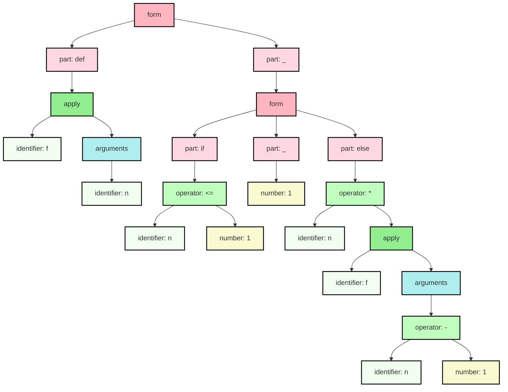

# Monogram

Monogram is a "no batteries" notation for writing domain-specific programs and
configuration files. It is easy for humans to read and write. It is easy for
machines to parse and generate. It deliberately borrows from many programming
languages but feels familiar to Python and Ruby programmers.

## _"It's source code, Jim. But not as we know it!"_

Here's an initial example to help explain what we mean by 'batteries not included'.
To experienced programmers, the following code looks a lot like the definition
of the factorial function:
```py
def f(n):
    if n <= 1:
        1
    else:
        n * f(n - 1)
    endif
enddef
```

However, the twist is that Monogram has no idea what `def` or `if` might mean!
Nor does it have a clue about `*` or `-` either. And it definitely cannot
execute this program. 

And yet Monogram can easily translate this example into neatly structured XML
(shown below). Or it can translate to [JSON](docs/json.md) or [YAML](docs/yaml.md).
```xml
<form>
    <part keyword="def">
        <apply kind="parentheses" separator="undefined">
            <identifier name="f"/>
            <arguments>
                <identifier name="n"/>
            </arguments>
        </apply>
    </part>
    <part keyword="_">
        <form>
            <part keyword="if">
                <operator name="&lt;=">
                    <identifier name="n"/>
                    <number value="1"/>
                </operator>
            </part>
            <part keyword="_">
                <number value="1"/>
            </part>
            <part keyword="else">
                <operator name="*">
                    <identifier name="n"/>
                    <apply kind="parentheses" separator="undefined">
                        <identifier name="f"/>
                        <arguments>
                            <operator name="-">
                                <identifier name="n"/>
                                <number value="1"/>
                            </operator>
                        </arguments>
                    </apply>
                </operator>
            </part>
        </form>
    </part>
</form>
```

Alternatively it can render the code as a diagram using Mermaid (below) or 
[Graphviz](docs/dot.md). Here's the same structure visualised as a graph.



In other words, Monogram is just a notation for writing program-like "code" but
comes without any built-in meanings. Although it is not infinitely flexible, it 
can often save you the effort of designing the syntax and implementing a parser
when you want an application/domain-specific language.

For more examples and more output formats (like JSON, YAML, PNG) see the 
[examples page](docs/examples.md).
