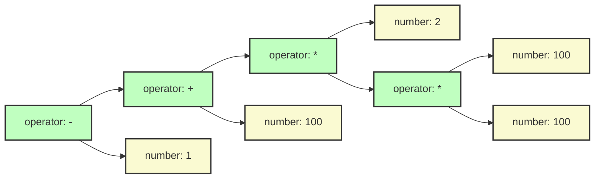
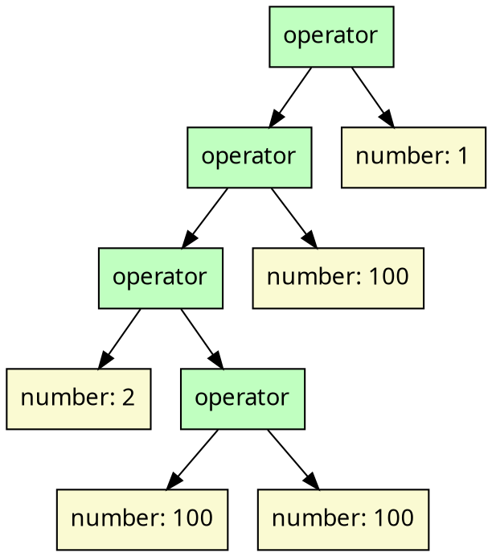

# Simple arithmetic expression

## Monogram

```txt
2 * 100 * 100 + 100 - 1
```

## Mermaid diagram

We can target Mermaid's flowchart as an output format. 
And this is what it looks like:



## XML

```xml
<operator name="-" syntax="infix">
    <operator name="+" syntax="infix">
        <operator name="*" syntax="infix">
            <number value="2"/>
            <operator name="*" syntax="infix">
                <number value="100"/>
                <number value="100"/>
            </operator>
        </operator>
        <number value="100"/>
    </operator>
    <number value="1"/>
</operator>
```

## JSON

We can target JSON as an output format. The format of each node is
a bit verbose but straightforward:

```json
{
    "role": "{{NODE NAME}}",
    "ATTRIBUTE_1": "VALUE_1", 
    ... 
    "ATTRIBUTE_N": "VALUE_N",
    "children": [ 
        ...
    ]
}
```

And this is what it expands into:

```json
{
    "role": "operator",
    "name": "-",
    "syntax": "infix",
    "children": [
        {
            "role": "operator",
            "name": "+",
            "syntax": "infix",
            "children": [
                {
                    "role": "operator",
                    "name": "*",
                    "syntax": "infix",
                    "children": [
                        {
                            "role": "number",
                            "value": 2
                        },
                        {
                            "role": "operator",
                            "name": "*",
                            "syntax": "infix",
                            "children": [
                                {
                                    "role": "number",
                                    "value": 100
                                },
                                {
                                    "role": "number",
                                    "value": 100
                                }
                            ]
                        }
                    ]
                },
                {
                    "role": "number",
                    "value": 100
                }
            ]
        },
        {
            "role": "number",
            "value": 1
        }
    ]
}
```

## YAML

We can target YAML as an output format. The format of each node is
a bit verbose but easy to understand.

```yaml
role": "{{NODE NAME}}",
ATTRIBUTE_1: VALUE_1,
...
children": 
- ...
- ...
```

And this is what it expands into:


```yaml
role: operator
name: '-'
syntax: infix
children:
- role: operator
  name: +
  syntax: infix
  children:
  - role: operator
    name: '*'
    syntax: infix
    children:
    - role: number
      value: 2
    - role: operator
      name: '*'
      syntax: infix
      children:
      - role: number
        value: 100
      - role: number
        value: 100
  - role: number
    value: 100
- role: number
  value: 1

```

## Graphviz Dot format




