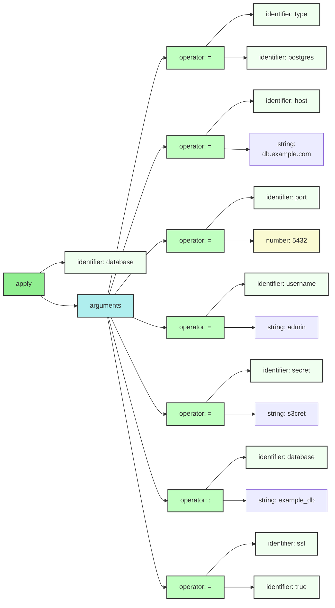
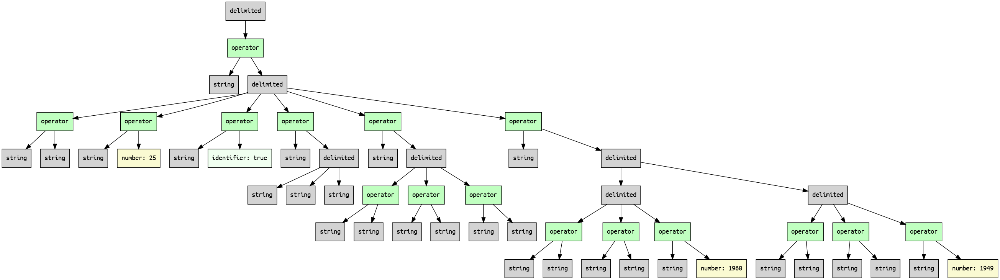

# Configuration

## Monogram

Monograph supports expressions that look like function calls with named 
arguments.  This can lead to configuration files that are easy to
understand.

```txt
# A simple example showing how a JSON example might be adapted in Monongram.
#
# {
#   "database": {
#     "type": "postgres",
#     "host": "db.example.com",
#     "port": 5432,
#     "username": "admin",
#     "password": "s3cret",
#     "database": "example_db",
#     "ssl": true
#   }
# }
#

# In our new version we avoid the outer superfluous braces in favour 
# of something that looks like a function call - suggesting an implementation
# strategy! The string quotes around the field names are discarded in favour
# of a form that looks like keyword arguments. 

database(
  type=postgres,          # Hints that the RDBMS types are defined elsewhere.
  host="db.example.com",
  port=5432,
  username="admin",
  secret="s3cret",
  database: "example_db",
  ssl=true
)

```

## Mermaid diagram

We can target Mermaid's flowchart as an output format. 
And this is what it looks like:



## XML

```xml
<apply kind="parentheses" separator="comma">
  <identifier name="database" />
  <arguments>
    <operator name="=" syntax="infix">
      <identifier name="type" />
      <identifier name="postgres" />
    </operator>
    <operator name="=" syntax="infix">
      <identifier name="host" />
      <string quote="double" value="db.example.com" />
    </operator>
    <operator name="=" syntax="infix">
      <identifier name="port" />
      <number value="5432" />
    </operator>
    <operator name="=" syntax="infix">
      <identifier name="username" />
      <string quote="double" value="admin" />
    </operator>
    <operator name="=" syntax="infix">
      <identifier name="secret" />
      <string quote="double" value="s3cret" />
    </operator>
    <operator name=":" syntax="infix">
      <identifier name="database" />
      <string quote="double" value="example_db" />
    </operator>
    <operator name="=" syntax="infix">
      <identifier name="ssl" />
      <identifier name="true" />
    </operator>
  </arguments>
</apply>
```

## JSON

We can target JSON as an output format. The format of each node is
a bit verbose but straightforward:

```json
{
    "role": "{{NODE NAME}}",
    "ATTRIBUTE_1": "VALUE_1", 
    ... 
    "ATTRIBUTE_N": "VALUE_N",
    "children": [ 
        ...
    ]
}
```

And this is what it expands into:

```json
{
  "role": "apply",
  "kind": "parentheses",
  "separator": "comma",
  "children": [
    {
      "role": "identifier",
      "name": "database"
    },
    {
      "role": "arguments",
      "children": [
        {
          "role": "operator",
          "syntax": "infix",
          "name": "=",
          "children": [
            {
              "role": "identifier",
              "name": "type"
            },
            {
              "role": "identifier",
              "name": "postgres"
            }
          ]
        },
        {
          "role": "operator",
          "name": "=",
          "syntax": "infix",
          "children": [
            {
              "role": "identifier",
              "name": "host"
            },
            {
              "role": "string",
              "value": "db.example.com",
              "quote": "double"
            }
          ]
        },
        {
          "role": "operator",
          "name": "=",
          "syntax": "infix",
          "children": [
            {
              "role": "identifier",
              "name": "port"
            },
            {
              "role": "number",
              "value": "5432"
            }
          ]
        },
        {
          "role": "operator",
          "syntax": "infix",
          "name": "=",
          "children": [
            {
              "role": "identifier",
              "name": "username"
            },
            {
              "role": "string",
              "quote": "double",
              "value": "admin"
            }
          ]
        },
        {
          "role": "operator",
          "syntax": "infix",
          "name": "=",
          "children": [
            {
              "role": "identifier",
              "name": "secret"
            },
            {
              "role": "string",
              "quote": "double",
              "value": "s3cret"
            }
          ]
        },
        {
          "role": "operator",
          "syntax": "infix",
          "name": ":",
          "children": [
            {
              "role": "identifier",
              "name": "database"
            },
            {
              "role": "string",
              "value": "example_db",
              "quote": "double"
            }
          ]
        },
        {
          "role": "operator",
          "syntax": "infix",
          "name": "=",
          "children": [
            {
              "role": "identifier",
              "name": "ssl"
            },
            {
              "role": "identifier",
              "name": "true"
            }
          ]
        }
      ]
    }
  ]
}```

## YAML

We can target YAML as an output format. The format of each node is
a bit verbose but easy to understand.

```yaml
role": "{{NODE NAME}}",
ATTRIBUTE_1: VALUE_1,
...
children": 
- ...
- ...
```

And this is what it expands into:


```yaml
kind: parentheses
separator: comma
children:
- role: identifier
  name: database
- role: arguments
  children:
  - role: operator
    name: =
    syntax: infix
    children:
    - role: identifier
      name: type
    - role: identifier
      name: postgres
  - role: operator
    name: =
    syntax: infix
    children:
    - role: identifier
      name: host
    - role: string
      quote: double
      value: db.example.com
  - role: operator
    name: =
    syntax: infix
    children:
    - role: identifier
      name: port
    - role: number
      value: 5432
  - role: operator
    name: =
    syntax: infix
    children:
    - role: identifier
      name: username
    - role: string
      quote: double
      value: admin
  - role: operator
    name: =
    syntax: infix
    children:
    - role: identifier
      name: secret
    - role: string
      quote: double
      value: s3cret
  - role: operator
    name: ":"
    syntax: infix
    children:
    - role: identifier
      name: database
    - role: string
      quote: double
      value: example_db
  - role: operator
    name: =
    syntax: infix
    children:
    - role: identifier
      name: ssl
    - role: identifier
      name: true
```

## Graphviz Dot format

```dot
digraph G {
  bgcolor="transparent";
  node [shape="box", style="filled", fontname="Ubuntu Mono"];
  "node_0xc0000aef30" [label="apply", shape="box", fillcolor="lightgreen"];
  "node_0xc0000ae6c0" [label="identifier: database", shape="box", fillcolor="Honeydew"];
  "node_0xc0000aef30" -> "node_0xc0000ae6c0";
  "node_0xc0000aeed0" [label="arguments", shape="box", fillcolor="PaleTurquoise"];
  "node_0xc0000aef30" -> "node_0xc0000aeed0";
  "node_0xc0000ae7e0" [label="operator: =", shape="box", fillcolor="#C0FFC0"];
  "node_0xc0000aeed0" -> "node_0xc0000ae7e0";
  "node_0xc0000ae720" [label="identifier: type", shape="box", fillcolor="Honeydew"];
  "node_0xc0000ae7e0" -> "node_0xc0000ae720";
  "node_0xc0000ae780" [label="identifier: postgres", shape="box", fillcolor="Honeydew"];
  "node_0xc0000ae7e0" -> "node_0xc0000ae780";
  "node_0xc0000ae900" [label="operator: =", shape="box", fillcolor="#C0FFC0"];
  "node_0xc0000aeed0" -> "node_0xc0000ae900";
  "node_0xc0000ae840" [label="identifier: host", shape="box", fillcolor="Honeydew"];
  "node_0xc0000ae900" -> "node_0xc0000ae840";
  "node_0xc0000ae8a0" [label="string: db.example.com", shape="box", fillcolor="lightgray"];
  "node_0xc0000ae900" -> "node_0xc0000ae8a0";
  "node_0xc0000aea20" [label="operator: =", shape="box", fillcolor="#C0FFC0"];
  "node_0xc0000aeed0" -> "node_0xc0000aea20";
  "node_0xc0000ae960" [label="identifier: port", shape="box", fillcolor="Honeydew"];
  "node_0xc0000aea20" -> "node_0xc0000ae960";
  "node_0xc0000ae9c0" [label="number: 5432", shape="box", fillcolor="lightgoldenrodyellow"];
  "node_0xc0000aea20" -> "node_0xc0000ae9c0";
  "node_0xc0000aeb40" [label="operator: =", shape="box", fillcolor="#C0FFC0"];
  "node_0xc0000aeed0" -> "node_0xc0000aeb40";
  "node_0xc0000aea80" [label="identifier: username", shape="box", fillcolor="Honeydew"];
  "node_0xc0000aeb40" -> "node_0xc0000aea80";
  "node_0xc0000aeae0" [label="string: admin", shape="box", fillcolor="lightgray"];
  "node_0xc0000aeb40" -> "node_0xc0000aeae0";
  "node_0xc0000aec60" [label="operator: =", shape="box", fillcolor="#C0FFC0"];
  "node_0xc0000aeed0" -> "node_0xc0000aec60";
  "node_0xc0000aeba0" [label="identifier: secret", shape="box", fillcolor="Honeydew"];
  "node_0xc0000aec60" -> "node_0xc0000aeba0";
  "node_0xc0000aec00" [label="string: s3cret", shape="box", fillcolor="lightgray"];
  "node_0xc0000aec60" -> "node_0xc0000aec00";
  "node_0xc0000aed80" [label="operator: :", shape="box", fillcolor="#C0FFC0"];
  "node_0xc0000aeed0" -> "node_0xc0000aed80";
  "node_0xc0000aecc0" [label="identifier: database", shape="box", fillcolor="Honeydew"];
  "node_0xc0000aed80" -> "node_0xc0000aecc0";
  "node_0xc0000aed20" [label="string: example_db", shape="box", fillcolor="lightgray"];
  "node_0xc0000aed80" -> "node_0xc0000aed20";
  "node_0xc0000aeea0" [label="operator: =", shape="box", fillcolor="#C0FFC0"];
  "node_0xc0000aeed0" -> "node_0xc0000aeea0";
  "node_0xc0000aede0" [label="identifier: ssl", shape="box", fillcolor="Honeydew"];
  "node_0xc0000aeea0" -> "node_0xc0000aede0";
  "node_0xc0000aee40" [label="identifier: true", shape="box", fillcolor="Honeydew"];
  "node_0xc0000aeea0" -> "node_0xc0000aee40";
}
```




