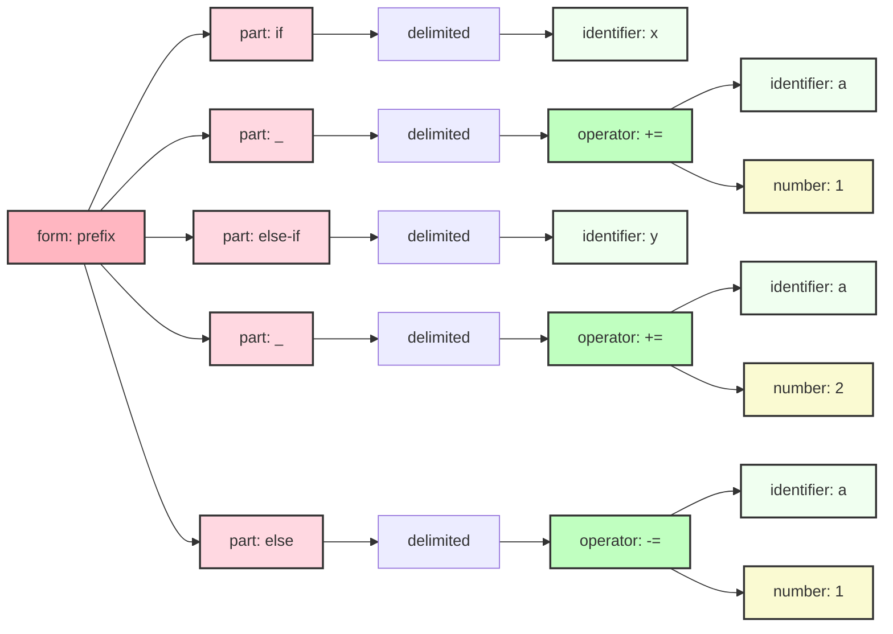
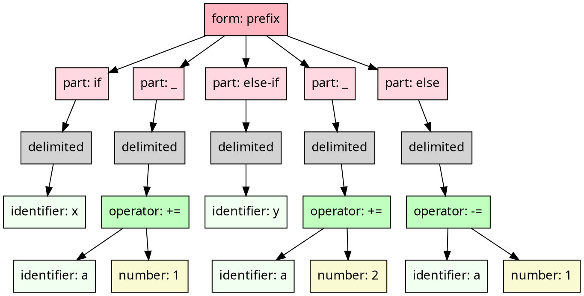
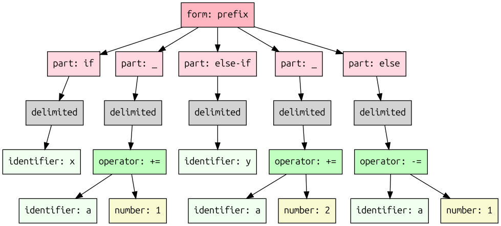

# C-style conditional

## Monogram

```txt
if! (x) {
  a += 1
} else-if (y) {
  a += 2
} else: {
  a -= 1
}```

## Mermaid diagram

We can target Mermaid's flowchart as an output format. 
And this is what it looks like:



## XML

```xml
<form syntax="prefix">
  <part keyword="if">
    <delimited kind="parentheses" separator="undefined">
      <identifier name="x" />
    </delimited>
  </part>
  <part keyword="_">
    <delimited kind="braces" separator="undefined">
      <operator name="+=" syntax="infix">
        <identifier name="a" />
        <number value="1" />
      </operator>
    </delimited>
  </part>
  <part keyword="else-if">
    <delimited kind="parentheses" separator="undefined">
      <identifier name="y" />
    </delimited>
  </part>
  <part keyword="_">
    <delimited kind="braces" separator="undefined">
      <operator name="+=" syntax="infix">
        <identifier name="a" />
        <number value="2" />
      </operator>
    </delimited>
  </part>
  <part keyword="else">
    <delimited kind="braces" separator="undefined">
      <operator name="-=" syntax="infix">
        <identifier name="a" />
        <number value="1" />
      </operator>
    </delimited>
  </part>
</form>
```

## JSON

We can target JSON as an output format. The format of each node is
a bit verbose but straightforward:

```json
{
    "role": "{{NODE NAME}}",
    "ATTRIBUTE_1": "VALUE_1", 
    ... 
    "ATTRIBUTE_N": "VALUE_N",
    "children": [ 
        ...
    ]
}
```

And this is what it expands into:

```json
{
  "role": "form",
  "syntax": "prefix",
  "children": [
    {
      "role": "part",
      "keyword": "if",
      "children": [
        {
          "role": "delimited",
          "kind": "parentheses",
          "separator": "undefined",
          "children": [
            {
              "role": "identifier",
              "name": "x"
            }
          ]
        }
      ]
    },
    {
      "role": "part",
      "keyword": "_",
      "children": [
        {
          "role": "delimited",
          "kind": "braces",
          "separator": "undefined",
          "children": [
            {
              "role": "operator",
              "syntax": "infix",
              "name": "+=",
              "children": [
                {
                  "role": "identifier",
                  "name": "a"
                },
                {
                  "role": "number",
                  "value": "1"
                }
              ]
            }
          ]
        }
      ]
    },
    {
      "role": "part",
      "keyword": "else-if",
      "children": [
        {
          "role": "delimited",
          "kind": "parentheses",
          "separator": "undefined",
          "children": [
            {
              "role": "identifier",
              "name": "y"
            }
          ]
        }
      ]
    },
    {
      "role": "part",
      "keyword": "_",
      "children": [
        {
          "role": "delimited",
          "kind": "braces",
          "separator": "undefined",
          "children": [
            {
              "role": "operator",
              "syntax": "infix",
              "name": "+=",
              "children": [
                {
                  "role": "identifier",
                  "name": "a"
                },
                {
                  "role": "number",
                  "value": "2"
                }
              ]
            }
          ]
        }
      ]
    },
    {
      "role": "part",
      "keyword": "else",
      "children": [
        {
          "role": "delimited",
          "kind": "braces",
          "separator": "undefined",
          "children": [
            {
              "role": "operator",
              "syntax": "infix",
              "name": "-=",
              "children": [
                {
                  "role": "identifier",
                  "name": "a"
                },
                {
                  "role": "number",
                  "value": "1"
                }
              ]
            }
          ]
        }
      ]
    }
  ]
}```

## YAML

We can target YAML as an output format. The format of each node is
a bit verbose but easy to understand.

```yaml
role": "{{NODE NAME}}",
ATTRIBUTE_1: VALUE_1,
...
children": 
- ...
- ...
```

And this is what it expands into:


```yaml
syntax: prefix
children:
- role: part
  keyword: if
  children:
  - role: delimited
    kind: parentheses
    separator: undefined
    children:
    - role: identifier
      name: x
- role: part
  keyword: _
  children:
  - role: delimited
    kind: braces
    separator: undefined
    children:
    - role: operator
      name: +=
      syntax: infix
      children:
      - role: identifier
        name: a
      - role: number
        value: 1
- role: part
  keyword: "else-if"
  children:
  - role: delimited
    kind: parentheses
    separator: undefined
    children:
    - role: identifier
      name: y
- role: part
  keyword: _
  children:
  - role: delimited
    kind: braces
    separator: undefined
    children:
    - role: operator
      name: +=
      syntax: infix
      children:
      - role: identifier
        name: a
      - role: number
        value: 2
- role: part
  keyword: else
  children:
  - role: delimited
    kind: braces
    separator: undefined
    children:
    - role: operator
      name: "-="
      syntax: infix
      children:
      - role: identifier
        name: a
      - role: number
        value: 1
```

## Graphviz Dot format




