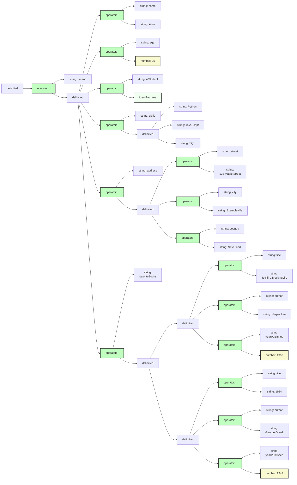

# JSON Expression

## Monogram

Monograph supports JSON expressions. Since Monogram is a good deal more 
complicated than JSON, it is not too surprising that translating a JSON
expression into a Monogram-tree looks quite different from plain JSON!

```txt
{
  "person": {
    "name": "Alice",
    "age": 25,
    "isStudent": true,
    "skills": ["Python", "JavaScript", "SQL"],
    "address": {
      "street": "123 Maple Street",
      "city": "Exampleville",
      "country": "Neverland"
    },
    "favoriteBooks": [
      {
        "title": "To Kill a Mockingbird",
        "author": "Harper Lee",
        "yearPublished": 1960
      },
      {
        "title": "1984",
        "author": "George Orwell",
        "yearPublished": 1949
      }
    ]
  }
}
```

## Mermaid diagram

We can target Mermaid's flowchart as an output format. 
And this is what it looks like:



## XML

```xml
<delimited kind="braces" separator="undefined">
  <operator name=":" syntax="infix">
    <string quote="double" value="person" />
    <delimited kind="braces" separator="comma">
      <operator name=":" syntax="infix">
        <string quote="double" value="name" />
        <string quote="double" value="Alice" />
      </operator>
      <operator name=":" syntax="infix">
        <string quote="double" value="age" />
        <number value="25" />
      </operator>
      <operator name=":" syntax="infix">
        <string quote="double" value="isStudent" />
        <identifier name="true" />
      </operator>
      <operator name=":" syntax="infix">
        <string quote="double" value="skills" />
        <delimited kind="brackets" separator="comma">
          <string quote="double" value="Python" />
          <string quote="double" value="JavaScript" />
          <string quote="double" value="SQL" />
        </delimited>
      </operator>
      <operator name=":" syntax="infix">
        <string quote="double" value="address" />
        <delimited kind="braces" separator="comma">
          <operator name=":" syntax="infix">
            <string quote="double" value="street" />
            <string quote="double" value="123 Maple Street" />
          </operator>
          <operator name=":" syntax="infix">
            <string quote="double" value="city" />
            <string quote="double" value="Exampleville" />
          </operator>
          <operator name=":" syntax="infix">
            <string quote="double" value="country" />
            <string quote="double" value="Neverland" />
          </operator>
        </delimited>
      </operator>
      <operator name=":" syntax="infix">
        <string quote="double" value="favoriteBooks" />
        <delimited kind="brackets" separator="comma">
          <delimited kind="braces" separator="comma">
            <operator name=":" syntax="infix">
              <string quote="double" value="title" />
              <string quote="double" value="To Kill a Mockingbird" />
            </operator>
            <operator name=":" syntax="infix">
              <string quote="double" value="author" />
              <string quote="double" value="Harper Lee" />
            </operator>
            <operator name=":" syntax="infix">
              <string quote="double" value="yearPublished" />
              <number value="1960" />
            </operator>
          </delimited>
          <delimited kind="braces" separator="comma">
            <operator name=":" syntax="infix">
              <string quote="double" value="title" />
              <string quote="double" value="1984" />
            </operator>
            <operator name=":" syntax="infix">
              <string quote="double" value="author" />
              <string quote="double" value="George Orwell" />
            </operator>
            <operator name=":" syntax="infix">
              <string quote="double" value="yearPublished" />
              <number value="1949" />
            </operator>
          </delimited>
        </delimited>
      </operator>
    </delimited>
  </operator>
</delimited>
```

## JSON

We can target JSON as an output format. The format of each node is
a bit verbose but straightforward:

```json
{
    "role": "{{NODE NAME}}",
    "ATTRIBUTE_1": "VALUE_1", 
    ... 
    "ATTRIBUTE_N": "VALUE_N",
    "children": [ 
        ...
    ]
}
```

And this is what it expands into:

```json
{
  "role": "delimited",
  "kind": "braces",
  "separator": "undefined",
  "children": [
    {
      "role": "operator",
      "syntax": "infix",
      "name": ":",
      "children": [
        {
          "role": "string",
          "quote": "double",
          "value": "person"
        },
        {
          "role": "delimited",
          "kind": "braces",
          "separator": "comma",
          "children": [
            {
              "role": "operator",
              "syntax": "infix",
              "name": ":",
              "children": [
                {
                  "role": "string",
                  "quote": "double",
                  "value": "name"
                },
                {
                  "role": "string",
                  "quote": "double",
                  "value": "Alice"
                }
              ]
            },
            {
              "role": "operator",
              "syntax": "infix",
              "name": ":",
              "children": [
                {
                  "role": "string",
                  "quote": "double",
                  "value": "age"
                },
                {
                  "role": "number",
                  "value": "25"
                }
              ]
            },
            {
              "role": "operator",
              "name": ":",
              "syntax": "infix",
              "children": [
                {
                  "role": "string",
                  "quote": "double",
                  "value": "isStudent"
                },
                {
                  "role": "identifier",
                  "name": "true"
                }
              ]
            },
            {
              "role": "operator",
              "syntax": "infix",
              "name": ":",
              "children": [
                {
                  "role": "string",
                  "quote": "double",
                  "value": "skills"
                },
                {
                  "role": "delimited",
                  "separator": "comma",
                  "kind": "brackets",
                  "children": [
                    {
                      "role": "string",
                      "quote": "double",
                      "value": "Python"
                    },
                    {
                      "role": "string",
                      "quote": "double",
                      "value": "JavaScript"
                    },
                    {
                      "role": "string",
                      "value": "SQL",
                      "quote": "double"
                    }
                  ]
                }
              ]
            },
            {
              "role": "operator",
              "syntax": "infix",
              "name": ":",
              "children": [
                {
                  "role": "string",
                  "quote": "double",
                  "value": "address"
                },
                {
                  "role": "delimited",
                  "kind": "braces",
                  "separator": "comma",
                  "children": [
                    {
                      "role": "operator",
                      "syntax": "infix",
                      "name": ":",
                      "children": [
                        {
                          "role": "string",
                          "quote": "double",
                          "value": "street"
                        },
                        {
                          "role": "string",
                          "quote": "double",
                          "value": "123 Maple Street"
                        }
                      ]
                    },
                    {
                      "role": "operator",
                      "syntax": "infix",
                      "name": ":",
                      "children": [
                        {
                          "role": "string",
                          "quote": "double",
                          "value": "city"
                        },
                        {
                          "role": "string",
                          "value": "Exampleville",
                          "quote": "double"
                        }
                      ]
                    },
                    {
                      "role": "operator",
                      "syntax": "infix",
                      "name": ":",
                      "children": [
                        {
                          "role": "string",
                          "value": "country",
                          "quote": "double"
                        },
                        {
                          "role": "string",
                          "value": "Neverland",
                          "quote": "double"
                        }
                      ]
                    }
                  ]
                }
              ]
            },
            {
              "role": "operator",
              "syntax": "infix",
              "name": ":",
              "children": [
                {
                  "role": "string",
                  "quote": "double",
                  "value": "favoriteBooks"
                },
                {
                  "role": "delimited",
                  "kind": "brackets",
                  "separator": "comma",
                  "children": [
                    {
                      "role": "delimited",
                      "kind": "braces",
                      "separator": "comma",
                      "children": [
                        {
                          "role": "operator",
                          "syntax": "infix",
                          "name": ":",
                          "children": [
                            {
                              "role": "string",
                              "quote": "double",
                              "value": "title"
                            },
                            {
                              "role": "string",
                              "quote": "double",
                              "value": "To Kill a Mockingbird"
                            }
                          ]
                        },
                        {
                          "role": "operator",
                          "syntax": "infix",
                          "name": ":",
                          "children": [
                            {
                              "role": "string",
                              "quote": "double",
                              "value": "author"
                            },
                            {
                              "role": "string",
                              "value": "Harper Lee",
                              "quote": "double"
                            }
                          ]
                        },
                        {
                          "role": "operator",
                          "syntax": "infix",
                          "name": ":",
                          "children": [
                            {
                              "role": "string",
                              "quote": "double",
                              "value": "yearPublished"
                            },
                            {
                              "role": "number",
                              "value": "1960"
                            }
                          ]
                        }
                      ]
                    },
                    {
                      "role": "delimited",
                      "kind": "braces",
                      "separator": "comma",
                      "children": [
                        {
                          "role": "operator",
                          "name": ":",
                          "syntax": "infix",
                          "children": [
                            {
                              "role": "string",
                              "quote": "double",
                              "value": "title"
                            },
                            {
                              "role": "string",
                              "quote": "double",
                              "value": "1984"
                            }
                          ]
                        },
                        {
                          "role": "operator",
                          "name": ":",
                          "syntax": "infix",
                          "children": [
                            {
                              "role": "string",
                              "value": "author",
                              "quote": "double"
                            },
                            {
                              "role": "string",
                              "quote": "double",
                              "value": "George Orwell"
                            }
                          ]
                        },
                        {
                          "role": "operator",
                          "syntax": "infix",
                          "name": ":",
                          "children": [
                            {
                              "role": "string",
                              "quote": "double",
                              "value": "yearPublished"
                            },
                            {
                              "role": "number",
                              "value": "1949"
                            }
                          ]
                        }
                      ]
                    }
                  ]
                }
              ]
            }
          ]
        }
      ]
    }
  ]
}```

## YAML

We can target YAML as an output format. The format of each node is
a bit verbose but easy to understand.

```yaml
role": "{{NODE NAME}}",
ATTRIBUTE_1: VALUE_1,
...
children": 
- ...
- ...
```

And this is what it expands into:


```yaml
kind: braces
separator: undefined
children:
- role: operator
  name: ":"
  syntax: infix
  children:
  - role: string
    quote: double
    value: person
  - role: delimited
    kind: braces
    separator: comma
    children:
    - role: operator
      name: ":"
      syntax: infix
      children:
      - role: string
        quote: double
        value: name
      - role: string
        quote: double
        value: Alice
    - role: operator
      name: ":"
      syntax: infix
      children:
      - role: string
        quote: double
        value: age
      - role: number
        value: 25
    - role: operator
      name: ":"
      syntax: infix
      children:
      - role: string
        quote: double
        value: isStudent
      - role: identifier
        name: true
    - role: operator
      name: ":"
      syntax: infix
      children:
      - role: string
        quote: double
        value: skills
      - role: delimited
        kind: brackets
        separator: comma
        children:
        - role: string
          quote: double
          value: Python
        - role: string
          quote: double
          value: JavaScript
        - role: string
          quote: double
          value: SQL
    - role: operator
      name: ":"
      syntax: infix
      children:
      - role: string
        quote: double
        value: address
      - role: delimited
        kind: braces
        separator: comma
        children:
        - role: operator
          name: ":"
          syntax: infix
          children:
          - role: string
            quote: double
            value: street
          - role: string
            quote: double
            value: 123 Maple Street
        - role: operator
          name: ":"
          syntax: infix
          children:
          - role: string
            quote: double
            value: city
          - role: string
            quote: double
            value: Exampleville
        - role: operator
          name: ":"
          syntax: infix
          children:
          - role: string
            quote: double
            value: country
          - role: string
            quote: double
            value: Neverland
    - role: operator
      name: ":"
      syntax: infix
      children:
      - role: string
        quote: double
        value: favoriteBooks
      - role: delimited
        kind: brackets
        separator: comma
        children:
        - role: delimited
          kind: braces
          separator: comma
          children:
          - role: operator
            name: ":"
            syntax: infix
            children:
            - role: string
              quote: double
              value: title
            - role: string
              quote: double
              value: To Kill a Mockingbird
          - role: operator
            name: ":"
            syntax: infix
            children:
            - role: string
              quote: double
              value: author
            - role: string
              quote: double
              value: Harper Lee
          - role: operator
            name: ":"
            syntax: infix
            children:
            - role: string
              quote: double
              value: yearPublished
            - role: number
              value: 1960
        - role: delimited
          kind: braces
          separator: comma
          children:
          - role: operator
            name: ":"
            syntax: infix
            children:
            - role: string
              quote: double
              value: title
            - role: string
              quote: double
              value: 1984
          - role: operator
            name: ":"
            syntax: infix
            children:
            - role: string
              quote: double
              value: author
            - role: string
              quote: double
              value: George Orwell
          - role: operator
            name: ":"
            syntax: infix
            children:
            - role: string
              quote: double
              value: yearPublished
            - role: number
              value: 1949
```

## Graphviz Dot format

```dot
digraph G {
  bgcolor="transparent";
  node [shape="box", style="filled", fontname="Ubuntu Mono"];
  "node_0xc00007d5f0" [label="delimited", shape="box", fillcolor="lightgray"];
  "node_0xc00007d590" [label="operator: :", shape="box", fillcolor="#C0FFC0"];
  "node_0xc00007d5f0" -> "node_0xc00007d590";
  "node_0xc00007c210" [label="string: person", shape="box", fillcolor="lightgray"];
  "node_0xc00007d590" -> "node_0xc00007c210";
  "node_0xc00007d530" [label="delimited", shape="box", fillcolor="lightgray"];
  "node_0xc00007d590" -> "node_0xc00007d530";
  "node_0xc00007c330" [label="operator: :", shape="box", fillcolor="#C0FFC0"];
  "node_0xc00007d530" -> "node_0xc00007c330";
  "node_0xc00007c270" [label="string: name", shape="box", fillcolor="lightgray"];
  "node_0xc00007c330" -> "node_0xc00007c270";
  "node_0xc00007c2d0" [label="string: Alice", shape="box", fillcolor="lightgray"];
  "node_0xc00007c330" -> "node_0xc00007c2d0";
  "node_0xc00007c450" [label="operator: :", shape="box", fillcolor="#C0FFC0"];
  "node_0xc00007d530" -> "node_0xc00007c450";
  "node_0xc00007c390" [label="string: age", shape="box", fillcolor="lightgray"];
  "node_0xc00007c450" -> "node_0xc00007c390";
  "node_0xc00007c3f0" [label="number: 25", shape="box", fillcolor="lightgoldenrodyellow"];
  "node_0xc00007c450" -> "node_0xc00007c3f0";
  "node_0xc00007c570" [label="operator: :", shape="box", fillcolor="#C0FFC0"];
  "node_0xc00007d530" -> "node_0xc00007c570";
  "node_0xc00007c4b0" [label="string: isStudent", shape="box", fillcolor="lightgray"];
  "node_0xc00007c570" -> "node_0xc00007c4b0";
  "node_0xc00007c510" [label="identifier: true", shape="box", fillcolor="Honeydew"];
  "node_0xc00007c570" -> "node_0xc00007c510";
  "node_0xc00007c7b0" [label="operator: :", shape="box", fillcolor="#C0FFC0"];
  "node_0xc00007d530" -> "node_0xc00007c7b0";
  "node_0xc00007c5d0" [label="string: skills", shape="box", fillcolor="lightgray"];
  "node_0xc00007c7b0" -> "node_0xc00007c5d0";
  "node_0xc00007c750" [label="delimited", shape="box", fillcolor="lightgray"];
  "node_0xc00007c7b0" -> "node_0xc00007c750";
  "node_0xc00007c630" [label="string: Python", shape="box", fillcolor="lightgray"];
  "node_0xc00007c750" -> "node_0xc00007c630";
  "node_0xc00007c690" [label="string: JavaScript", shape="box", fillcolor="lightgray"];
  "node_0xc00007c750" -> "node_0xc00007c690";
  "node_0xc00007c6f0" [label="string: SQL", shape="box", fillcolor="lightgray"];
  "node_0xc00007c750" -> "node_0xc00007c6f0";
  "node_0xc00007cc30" [label="operator: :", shape="box", fillcolor="#C0FFC0"];
  "node_0xc00007d530" -> "node_0xc00007cc30";
  "node_0xc00007c810" [label="string: address", shape="box", fillcolor="lightgray"];
  "node_0xc00007cc30" -> "node_0xc00007c810";
  "node_0xc00007cbd0" [label="delimited", shape="box", fillcolor="lightgray"];
  "node_0xc00007cc30" -> "node_0xc00007cbd0";
  "node_0xc00007c930" [label="operator: :", shape="box", fillcolor="#C0FFC0"];
  "node_0xc00007cbd0" -> "node_0xc00007c930";
  "node_0xc00007c870" [label="string: street", shape="box", fillcolor="lightgray"];
  "node_0xc00007c930" -> "node_0xc00007c870";
  "node_0xc00007c8d0" [label="string: 123 Maple Street", shape="box", fillcolor="lightgray"];
  "node_0xc00007c930" -> "node_0xc00007c8d0";
  "node_0xc00007ca50" [label="operator: :", shape="box", fillcolor="#C0FFC0"];
  "node_0xc00007cbd0" -> "node_0xc00007ca50";
  "node_0xc00007c990" [label="string: city", shape="box", fillcolor="lightgray"];
  "node_0xc00007ca50" -> "node_0xc00007c990";
  "node_0xc00007c9f0" [label="string: Exampleville", shape="box", fillcolor="lightgray"];
  "node_0xc00007ca50" -> "node_0xc00007c9f0";
  "node_0xc00007cb70" [label="operator: :", shape="box", fillcolor="#C0FFC0"];
  "node_0xc00007cbd0" -> "node_0xc00007cb70";
  "node_0xc00007cab0" [label="string: country", shape="box", fillcolor="lightgray"];
  "node_0xc00007cb70" -> "node_0xc00007cab0";
  "node_0xc00007cb10" [label="string: Neverland", shape="box", fillcolor="lightgray"];
  "node_0xc00007cb70" -> "node_0xc00007cb10";
  "node_0xc00007d4d0" [label="operator: :", shape="box", fillcolor="#C0FFC0"];
  "node_0xc00007d530" -> "node_0xc00007d4d0";
  "node_0xc00007cc90" [label="string: favoriteBooks", shape="box", fillcolor="lightgray"];
  "node_0xc00007d4d0" -> "node_0xc00007cc90";
  "node_0xc00007d470" [label="delimited", shape="box", fillcolor="lightgray"];
  "node_0xc00007d4d0" -> "node_0xc00007d470";
  "node_0xc00007d050" [label="delimited", shape="box", fillcolor="lightgray"];
  "node_0xc00007d470" -> "node_0xc00007d050";
  "node_0xc00007cdb0" [label="operator: :", shape="box", fillcolor="#C0FFC0"];
  "node_0xc00007d050" -> "node_0xc00007cdb0";
  "node_0xc00007ccf0" [label="string: title", shape="box", fillcolor="lightgray"];
  "node_0xc00007cdb0" -> "node_0xc00007ccf0";
  "node_0xc00007cd50" [label="string: To Kill a Mockingbird", shape="box", fillcolor="lightgray"];
  "node_0xc00007cdb0" -> "node_0xc00007cd50";
  "node_0xc00007ced0" [label="operator: :", shape="box", fillcolor="#C0FFC0"];
  "node_0xc00007d050" -> "node_0xc00007ced0";
  "node_0xc00007ce10" [label="string: author", shape="box", fillcolor="lightgray"];
  "node_0xc00007ced0" -> "node_0xc00007ce10";
  "node_0xc00007ce70" [label="string: Harper Lee", shape="box", fillcolor="lightgray"];
  "node_0xc00007ced0" -> "node_0xc00007ce70";
  "node_0xc00007cff0" [label="operator: :", shape="box", fillcolor="#C0FFC0"];
  "node_0xc00007d050" -> "node_0xc00007cff0";
  "node_0xc00007cf30" [label="string: yearPublished", shape="box", fillcolor="lightgray"];
  "node_0xc00007cff0" -> "node_0xc00007cf30";
  "node_0xc00007cf90" [label="number: 1960", shape="box", fillcolor="lightgoldenrodyellow"];
  "node_0xc00007cff0" -> "node_0xc00007cf90";
  "node_0xc00007d410" [label="delimited", shape="box", fillcolor="lightgray"];
  "node_0xc00007d470" -> "node_0xc00007d410";
  "node_0xc00007d170" [label="operator: :", shape="box", fillcolor="#C0FFC0"];
  "node_0xc00007d410" -> "node_0xc00007d170";
  "node_0xc00007d0b0" [label="string: title", shape="box", fillcolor="lightgray"];
  "node_0xc00007d170" -> "node_0xc00007d0b0";
  "node_0xc00007d110" [label="string: 1984", shape="box", fillcolor="lightgray"];
  "node_0xc00007d170" -> "node_0xc00007d110";
  "node_0xc00007d290" [label="operator: :", shape="box", fillcolor="#C0FFC0"];
  "node_0xc00007d410" -> "node_0xc00007d290";
  "node_0xc00007d1d0" [label="string: author", shape="box", fillcolor="lightgray"];
  "node_0xc00007d290" -> "node_0xc00007d1d0";
  "node_0xc00007d230" [label="string: George Orwell", shape="box", fillcolor="lightgray"];
  "node_0xc00007d290" -> "node_0xc00007d230";
  "node_0xc00007d3b0" [label="operator: :", shape="box", fillcolor="#C0FFC0"];
  "node_0xc00007d410" -> "node_0xc00007d3b0";
  "node_0xc00007d2f0" [label="string: yearPublished", shape="box", fillcolor="lightgray"];
  "node_0xc00007d3b0" -> "node_0xc00007d2f0";
  "node_0xc00007d350" [label="number: 1949", shape="box", fillcolor="lightgoldenrodyellow"];
  "node_0xc00007d3b0" -> "node_0xc00007d350";
}
```




