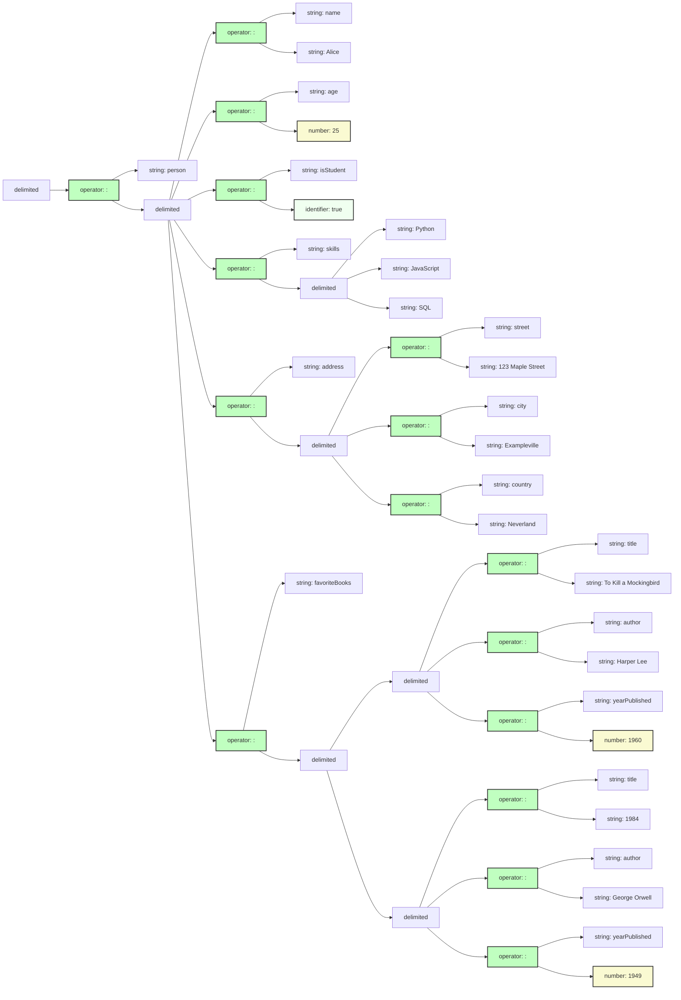

# JSON Expression

## Monogram

Monograph supports JSON expressions:

```txt
{
  "person": {
    "name": "Alice",
    "age": 25,
    "isStudent": true,
    "skills": ["Python", "JavaScript", "SQL"],
    "address": {
      "street": "123 Maple Street",
      "city": "Exampleville",
      "country": "Neverland"
    },
    "favoriteBooks": [
      {
        "title": "To Kill a Mockingbird",
        "author": "Harper Lee",
        "yearPublished": 1960
      },
      {
        "title": "1984",
        "author": "George Orwell",
        "yearPublished": 1949
      }
    ]
  }
}
```

## Mermaid diagram

We can target Mermaid's flowchart as an output format. 
And this is what it looks like:



## XML

```xml
<delimited kind="braces" separator="undefined">
    <operator name=":">
        <string quote=":" value="person"/>
        <delimited kind="braces" separator="comma">
            <operator name=":">
                <string quote=":" value="name"/>
                <string quote="," value="Alice"/>
            </operator>
            <operator name=":">
                <string quote=":" value="age"/>
                <number value="25"/>
            </operator>
            <operator name=":">
                <string quote=":" value="isStudent"/>
                <identifier name="true"/>
            </operator>
            <operator name=":">
                <string quote=":" value="skills"/>
                <delimited kind="brackets" separator="comma">
                    <string quote="," value="Python"/>
                    <string quote="," value="JavaScript"/>
                    <string quote="]" value="SQL"/>
                </delimited>
            </operator>
            <operator name=":">
                <string quote=":" value="address"/>
                <delimited kind="braces" separator="comma">
                    <operator name=":">
                        <string quote=":" value="street"/>
                        <string quote="," value="123 Maple Street"/>
                    </operator>
                    <operator name=":">
                        <string quote=":" value="city"/>
                        <string quote="," value="Exampleville"/>
                    </operator>
                    <operator name=":">
                        <string quote=":" value="country"/>
                        <string quote="&quot;" value="Neverland"/>
                    </operator>
                </delimited>
            </operator>
            <operator name=":">
                <string quote=":" value="favoriteBooks"/>
                <delimited kind="brackets" separator="comma">
                    <delimited kind="braces" separator="comma">
                        <operator name=":">
                            <string quote=":" value="title"/>
                            <string quote="," value="To Kill a Mockingbird"/>
                        </operator>
                        <operator name=":">
                            <string quote=":" value="author"/>
                            <string quote="," value="Harper Lee"/>
                        </operator>
                        <operator name=":">
                            <string quote=":" value="yearPublished"/>
                            <number value="1960"/>
                        </operator>
                    </delimited>
                    <delimited kind="braces" separator="comma">
                        <operator name=":">
                            <string quote=":" value="title"/>
                            <string quote="," value="1984"/>
                        </operator>
                        <operator name=":">
                            <string quote=":" value="author"/>
                            <string quote="," value="George Orwell"/>
                        </operator>
                        <operator name=":">
                            <string quote=":" value="yearPublished"/>
                            <number value="1949"/>
                        </operator>
                    </delimited>
                </delimited>
            </operator>
        </delimited>
    </operator>
</delimited>
```

## JSON

We can target JSON as an output format. The format of each node is
a bit verbose but straightforward:

```json
{
    "role": "{{NODE NAME}}",
    "ATTRIBUTE_1": "VALUE_1", 
    ... 
    "ATTRIBUTE_N": "VALUE_N",
    "children": [ 
        ...
    ]
}
```

And this is what it expands into:

```json
{
    "role": "delimited",
    "kind": "braces",
    "separator": "undefined",
    "children": [
        {
            "role": "operator",
            "name": ":",
            "children": [
                {
                    "role": "string",
                    "quote": ":",
                    "value": "person"
                },
                {
                    "role": "delimited",
                    "kind": "braces",
                    "separator": "comma",
                    "children": [
                        {
                            "role": "operator",
                            "name": ":",
                            "children": [
                                {
                                    "role": "string",
                                    "quote": ":",
                                    "value": "name"
                                },
                                {
                                    "role": "string",
                                    "quote": ",",
                                    "value": "Alice"
                                }
                            ]
                        },
                        {
                            "role": "operator",
                            "name": ":",
                            "children": [
                                {
                                    "role": "string",
                                    "quote": ":",
                                    "value": "age"
                                },
                                {
                                    "role": "number",
                                    "value": 25
                                }
                            ]
                        },
                        {
                            "role": "operator",
                            "name": ":",
                            "children": [
                                {
                                    "role": "string",
                                    "quote": ":",
                                    "value": "isStudent"
                                },
                                {
                                    "role": "identifier",
                                    "name": "true"
                                }
                            ]
                        },
                        {
                            "role": "operator",
                            "name": ":",
                            "children": [
                                {
                                    "role": "string",
                                    "quote": ":",
                                    "value": "skills"
                                },
                                {
                                    "role": "delimited",
                                    "kind": "brackets",
                                    "separator": "comma",
                                    "children": [
                                        {
                                            "role": "string",
                                            "quote": ",",
                                            "value": "Python"
                                        },
                                        {
                                            "role": "string",
                                            "quote": ",",
                                            "value": "JavaScript"
                                        },
                                        {
                                            "role": "string",
                                            "quote": "]",
                                            "value": "SQL"
                                        }
                                    ]
                                }
                            ]
                        },
                        {
                            "role": "operator",
                            "name": ":",
                            "children": [
                                {
                                    "role": "string",
                                    "quote": ":",
                                    "value": "address"
                                },
                                {
                                    "role": "delimited",
                                    "kind": "braces",
                                    "separator": "comma",
                                    "children": [
                                        {
                                            "role": "operator",
                                            "name": ":",
                                            "children": [
                                                {
                                                    "role": "string",
                                                    "quote": ":",
                                                    "value": "street"
                                                },
                                                {
                                                    "role": "string",
                                                    "quote": ",",
                                                    "value": "123 Maple Street"
                                                }
                                            ]
                                        },
                                        {
                                            "role": "operator",
                                            "name": ":",
                                            "children": [
                                                {
                                                    "role": "string",
                                                    "quote": ":",
                                                    "value": "city"
                                                },
                                                {
                                                    "role": "string",
                                                    "quote": ",",
                                                    "value": "Exampleville"
                                                }
                                            ]
                                        },
                                        {
                                            "role": "operator",
                                            "name": ":",
                                            "children": [
                                                {
                                                    "role": "string",
                                                    "quote": ":",
                                                    "value": "country"
                                                },
                                                {
                                                    "role": "string",
                                                    "quote": "\"",
                                                    "value": "Neverland"
                                                }
                                            ]
                                        }
                                    ]
                                }
                            ]
                        },
                        {
                            "role": "operator",
                            "name": ":",
                            "children": [
                                {
                                    "role": "string",
                                    "quote": ":",
                                    "value": "favoriteBooks"
                                },
                                {
                                    "role": "delimited",
                                    "kind": "brackets",
                                    "separator": "comma",
                                    "children": [
                                        {
                                            "role": "delimited",
                                            "kind": "braces",
                                            "separator": "comma",
                                            "children": [
                                                {
                                                    "role": "operator",
                                                    "name": ":",
                                                    "children": [
                                                        {
                                                            "role": "string",
                                                            "quote": ":",
                                                            "value": "title"
                                                        },
                                                        {
                                                            "role": "string",
                                                            "quote": ",",
                                                            "value": "To Kill a Mockingbird"
                                                        }
                                                    ]
                                                },
                                                {
                                                    "role": "operator",
                                                    "name": ":",
                                                    "children": [
                                                        {
                                                            "role": "string",
                                                            "quote": ":",
                                                            "value": "author"
                                                        },
                                                        {
                                                            "role": "string",
                                                            "quote": ",",
                                                            "value": "Harper Lee"
                                                        }
                                                    ]
                                                },
                                                {
                                                    "role": "operator",
                                                    "name": ":",
                                                    "children": [
                                                        {
                                                            "role": "string",
                                                            "quote": ":",
                                                            "value": "yearPublished"
                                                        },
                                                        {
                                                            "role": "number",
                                                            "value": 1960
                                                        }
                                                    ]
                                                }
                                            ]
                                        },
                                        {
                                            "role": "delimited",
                                            "kind": "braces",
                                            "separator": "comma",
                                            "children": [
                                                {
                                                    "role": "operator",
                                                    "name": ":",
                                                    "children": [
                                                        {
                                                            "role": "string",
                                                            "quote": ":",
                                                            "value": "title"
                                                        },
                                                        {
                                                            "role": "string",
                                                            "quote": ",",
                                                            "value": "1984"
                                                        }
                                                    ]
                                                },
                                                {
                                                    "role": "operator",
                                                    "name": ":",
                                                    "children": [
                                                        {
                                                            "role": "string",
                                                            "quote": ":",
                                                            "value": "author"
                                                        },
                                                        {
                                                            "role": "string",
                                                            "quote": ",",
                                                            "value": "George Orwell"
                                                        }
                                                    ]
                                                },
                                                {
                                                    "role": "operator",
                                                    "name": ":",
                                                    "children": [
                                                        {
                                                            "role": "string",
                                                            "quote": ":",
                                                            "value": "yearPublished"
                                                        },
                                                        {
                                                            "role": "number",
                                                            "value": 1949
                                                        }
                                                    ]
                                                }
                                            ]
                                        }
                                    ]
                                }
                            ]
                        }
                    ]
                }
            ]
        }
    ]
}
```

## YAML

We can target YAML as an output format. The format of each node is
a bit verbose but easy to understand.

```yaml
role": "{{NODE NAME}}",
ATTRIBUTE_1: VALUE_1,
...
children": 
- ...
- ...
```

And this is what it expands into:


```yaml
role: delimited
kind: braces
separator: undefined
children:
- role: operator
  name: ':'
  children:
  - role: string
    quote: ':'
    value: person
  - role: delimited
    kind: braces
    separator: comma
    children:
    - role: operator
      name: ':'
      children:
      - role: string
        quote: ':'
        value: name
      - role: string
        quote: ','
        value: Alice
    - role: operator
      name: ':'
      children:
      - role: string
        quote: ':'
        value: age
      - role: number
        value: 25
    - role: operator
      name: ':'
      children:
      - role: string
        quote: ':'
        value: isStudent
      - role: identifier
        name: 'true'
    - role: operator
      name: ':'
      children:
      - role: string
        quote: ':'
        value: skills
      - role: delimited
        kind: brackets
        separator: comma
        children:
        - role: string
          quote: ','
          value: Python
        - role: string
          quote: ','
          value: JavaScript
        - role: string
          quote: ']'
          value: SQL
    - role: operator
      name: ':'
      children:
      - role: string
        quote: ':'
        value: address
      - role: delimited
        kind: braces
        separator: comma
        children:
        - role: operator
          name: ':'
          children:
          - role: string
            quote: ':'
            value: street
          - role: string
            quote: ','
            value: 123 Maple Street
        - role: operator
          name: ':'
          children:
          - role: string
            quote: ':'
            value: city
          - role: string
            quote: ','
            value: Exampleville
        - role: operator
          name: ':'
          children:
          - role: string
            quote: ':'
            value: country
          - role: string
            quote: '"'
            value: Neverland
    - role: operator
      name: ':'
      children:
      - role: string
        quote: ':'
        value: favoriteBooks
      - role: delimited
        kind: brackets
        separator: comma
        children:
        - role: delimited
          kind: braces
          separator: comma
          children:
          - role: operator
            name: ':'
            children:
            - role: string
              quote: ':'
              value: title
            - role: string
              quote: ','
              value: To Kill a Mockingbird
          - role: operator
            name: ':'
            children:
            - role: string
              quote: ':'
              value: author
            - role: string
              quote: ','
              value: Harper Lee
          - role: operator
            name: ':'
            children:
            - role: string
              quote: ':'
              value: yearPublished
            - role: number
              value: 1960
        - role: delimited
          kind: braces
          separator: comma
          children:
          - role: operator
            name: ':'
            children:
            - role: string
              quote: ':'
              value: title
            - role: string
              quote: ','
              value: '1984'
          - role: operator
            name: ':'
            children:
            - role: string
              quote: ':'
              value: author
            - role: string
              quote: ','
              value: George Orwell
          - role: operator
            name: ':'
            children:
            - role: string
              quote: ':'
              value: yearPublished
            - role: number
              value: 1949

```

## Graphviz Dot format

```dot
digraph G {
  bgcolor="transparent";
  node [shape="box", style="filled", fontname="Ubuntu Mono"];
  "128030047569216" [label="delimited", shape="box", fillcolor="lightgray"];
  "128030047569296" [label="operator: :", shape="box", fillcolor="#C0FFC0"];
  "128030047569216" -> "128030047569296";
  "128030047569376" [label="string", shape="box", fillcolor="lightgray"];
  "128030047569296" -> "128030047569376";
  "128030047569456" [label="delimited", shape="box", fillcolor="lightgray"];
  "128030047569296" -> "128030047569456";
  "128030047569536" [label="operator: :", shape="box", fillcolor="#C0FFC0"];
  "128030047569456" -> "128030047569536";
  "128030047569616" [label="string", shape="box", fillcolor="lightgray"];
  "128030047569536" -> "128030047569616";
  "128030047569696" [label="string", shape="box", fillcolor="lightgray"];
  "128030047569536" -> "128030047569696";
  "128030047569776" [label="operator: :", shape="box", fillcolor="#C0FFC0"];
  "128030047569456" -> "128030047569776";
  "128030047569856" [label="string", shape="box", fillcolor="lightgray"];
  "128030047569776" -> "128030047569856";
  "128030047569936" [label="number: 25", shape="box", fillcolor="lightgoldenrodyellow"];
  "128030047569776" -> "128030047569936";
  "128030047570016" [label="operator: :", shape="box", fillcolor="#C0FFC0"];
  "128030047569456" -> "128030047570016";
  "128030047570096" [label="string", shape="box", fillcolor="lightgray"];
  "128030047570016" -> "128030047570096";
  "128030047570176" [label="identifier: true", shape="box", fillcolor="Honeydew"];
  "128030047570016" -> "128030047570176";
  "128030047570256" [label="operator: :", shape="box", fillcolor="#C0FFC0"];
  "128030047569456" -> "128030047570256";
  "128030047570336" [label="string", shape="box", fillcolor="lightgray"];
  "128030047570256" -> "128030047570336";
  "128030047570416" [label="delimited", shape="box", fillcolor="lightgray"];
  "128030047570256" -> "128030047570416";
  "128030047570496" [label="string", shape="box", fillcolor="lightgray"];
  "128030047570416" -> "128030047570496";
  "128030047570576" [label="string", shape="box", fillcolor="lightgray"];
  "128030047570416" -> "128030047570576";
  "128030047570656" [label="string", shape="box", fillcolor="lightgray"];
  "128030047570416" -> "128030047570656";
  "128030047570736" [label="operator: :", shape="box", fillcolor="#C0FFC0"];
  "128030047569456" -> "128030047570736";
  "128030047570816" [label="string", shape="box", fillcolor="lightgray"];
  "128030047570736" -> "128030047570816";
  "128030047570896" [label="delimited", shape="box", fillcolor="lightgray"];
  "128030047570736" -> "128030047570896";
  "128030047570976" [label="operator: :", shape="box", fillcolor="#C0FFC0"];
  "128030047570896" -> "128030047570976";
  "128030047571136" [label="string", shape="box", fillcolor="lightgray"];
  "128030047570976" -> "128030047571136";
  "128030047571296" [label="string", shape="box", fillcolor="lightgray"];
  "128030047570976" -> "128030047571296";
  "128030047571376" [label="operator: :", shape="box", fillcolor="#C0FFC0"];
  "128030047570896" -> "128030047571376";
  "128030047571536" [label="string", shape="box", fillcolor="lightgray"];
  "128030047571376" -> "128030047571536";
  "128030047571696" [label="string", shape="box", fillcolor="lightgray"];
  "128030047571376" -> "128030047571696";
  "128030047571776" [label="operator: :", shape="box", fillcolor="#C0FFC0"];
  "128030047570896" -> "128030047571776";
  "128030047571936" [label="string", shape="box", fillcolor="lightgray"];
  "128030047571776" -> "128030047571936";
  "128030047572096" [label="string", shape="box", fillcolor="lightgray"];
  "128030047571776" -> "128030047572096";
  "128030047572176" [label="operator: :", shape="box", fillcolor="#C0FFC0"];
  "128030047569456" -> "128030047572176";
  "128030047572256" [label="string", shape="box", fillcolor="lightgray"];
  "128030047572176" -> "128030047572256";
  "128030047572336" [label="delimited", shape="box", fillcolor="lightgray"];
  "128030047572176" -> "128030047572336";
  "128030047572416" [label="delimited", shape="box", fillcolor="lightgray"];
  "128030047572336" -> "128030047572416";
  "128030047572576" [label="operator: :", shape="box", fillcolor="#C0FFC0"];
  "128030047572416" -> "128030047572576";
  "128030047572736" [label="string", shape="box", fillcolor="lightgray"];
  "128030047572576" -> "128030047572736";
  "128030047572896" [label="string", shape="box", fillcolor="lightgray"];
  "128030047572576" -> "128030047572896";
  "128030047573136" [label="operator: :", shape="box", fillcolor="#C0FFC0"];
  "128030047572416" -> "128030047573136";
  "128030047573296" [label="string", shape="box", fillcolor="lightgray"];
  "128030047573136" -> "128030047573296";
  "128030047573456" [label="string", shape="box", fillcolor="lightgray"];
  "128030047573136" -> "128030047573456";
  "128030047573696" [label="operator: :", shape="box", fillcolor="#C0FFC0"];
  "128030047572416" -> "128030047573696";
  "128030047573856" [label="string", shape="box", fillcolor="lightgray"];
  "128030047573696" -> "128030047573856";
  "128030047574016" [label="number: 1960", shape="box", fillcolor="lightgoldenrodyellow"];
  "128030047573696" -> "128030047574016";
  "128030047574176" [label="delimited", shape="box", fillcolor="lightgray"];
  "128030047572336" -> "128030047574176";
  "128030047574336" [label="operator: :", shape="box", fillcolor="#C0FFC0"];
  "128030047574176" -> "128030047574336";
  "128030047574496" [label="string", shape="box", fillcolor="lightgray"];
  "128030047574336" -> "128030047574496";
  "128030047574656" [label="string", shape="box", fillcolor="lightgray"];
  "128030047574336" -> "128030047574656";
  "128030047574896" [label="operator: :", shape="box", fillcolor="#C0FFC0"];
  "128030047574176" -> "128030047574896";
  "128030047575056" [label="string", shape="box", fillcolor="lightgray"];
  "128030047574896" -> "128030047575056";
  "128030047575216" [label="string", shape="box", fillcolor="lightgray"];
  "128030047574896" -> "128030047575216";
  "128030047575456" [label="operator: :", shape="box", fillcolor="#C0FFC0"];
  "128030047574176" -> "128030047575456";
  "128030047575616" [label="string", shape="box", fillcolor="lightgray"];
  "128030047575456" -> "128030047575616";
  "128030047575776" [label="number: 1949", shape="box", fillcolor="lightgoldenrodyellow"];
  "128030047575456" -> "128030047575776";
}
```




